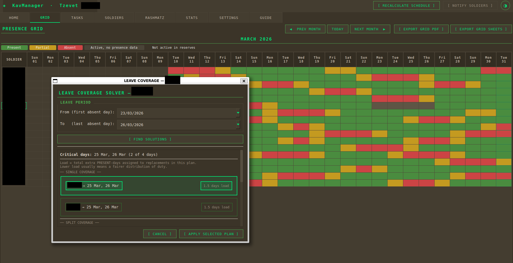
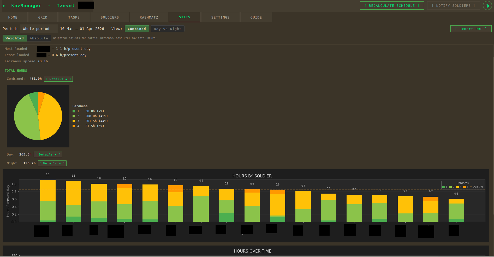
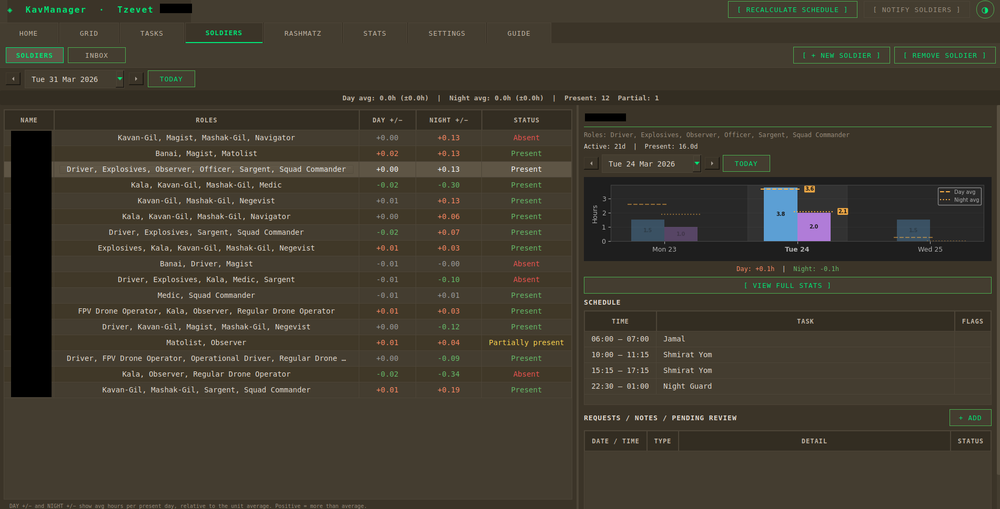
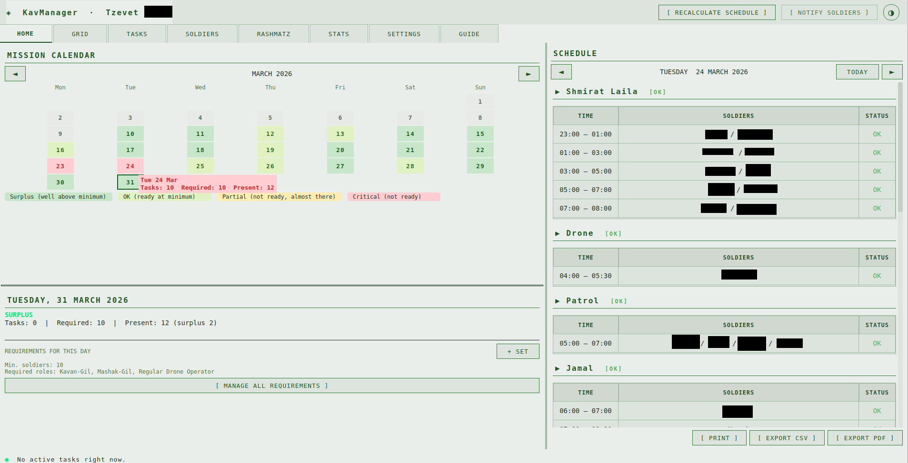

# KavManager

Reserve unit management app that automates fair duty scheduling using linear programming.




## What Is This?

A desktop app for managing reserve duty units. It tracks soldier presence, computes readiness, and automatically generates fair schedules. The desktop interface is intended for commanders; soldiers interact through an E2E encrypted Matrix chat bot on their phones. Ideally, a unit runs the app on a dedicated computer that stays on throughout the reserve period, keeping the scheduling engine and bot available around the clock.

The core challenge: assigning soldiers to tasks while respecting dozens of constraints — rest periods between shifts, night shift limits, role requirements, commander exclusions, minimum block durations, gearing-up windows. Doing this by hand is slow, error-prone, and almost always unfair to someone.

KavManager uses a two-stage LP solver (PuLP/CBC) that optimizes day and night shifts separately across time blocks. It divides each period into uniform blocks, tries multiple block lengths (60–180 minutes), and picks the configuration with the best objective score. The solver handles fairness (workload spread), proximity penalties (preventing back-to-back shifts), night quality steering, cross-domain rest gaps, and more — all as soft constraints in the LP objective.

The app includes a Matrix chat bot (E2E encrypted) so soldiers can check their schedules, swap shifts, report issues, and log unplanned tasks — all from their phone, without needing the desktop app.

Currently a pilot — functional and tested, but needs real-world deployment and feedback.

## How It Was Built

I built this in about a month using Claude Code as the primary development tool.

The motivation is personal. I witnessed how making a fair schedule is a wretched, almost impossible task. They're usually done from gut feeling, they lead to friction among team members, and worst of all — every time there's a *baltam* (an unexpected event), the whole schedule can fall apart since everything has to be replanned from scratch.

I started with a greedy algorithm that assigned one soldier at a time. It worked for simple cases, but greedy decisions are local — it couldn't weigh tradeoffs across the entire schedule simultaneously. A soldier assigned to a night shift early in the process might end up being the only one available for a critical day shift later, and the algorithm had no way to see that coming.

The greedy code kept growing with patches and special cases, getting worse not better. The engine file alone was 3,500 lines. Moving to LP was a fundamental shift — instead of making sequential decisions, the solver sees every possible assignment simultaneously and optimizes globally. The engine dropped from 3,500 lines to 650. The LP solver itself is about 2,400 lines, but those lines handle more constraints correctly than the greedy approach ever could, because constraints are declarative (add them to the LP formulation) rather than procedural (write another special-case branch).

The LP formulation went through multiple iterations. Cross-midnight tasks needed period segmentation. Fractionable tasks (split into blocks) needed different handling than fixed tasks (one soldier for the whole window). Night shifts needed quality tiers and wakeup penalties. Adjacent blocks needed proximity penalties to prevent back-to-back assignments — and getting the penalty curve right took several attempts, because a naive implementation actually made the solver *prefer* continuous stretches over spaced-out shifts.

One of the biggest challenges was reconciliation. In reserve duty, plans change constantly — an emergency mission drops in, a soldier becomes unavailable at 2am. Each change cascades through the whole schedule. The engine handles this by freezing every assignment that's already in progress or where the soldier has started gearing up (preparing equipment, traveling to post). Everything else gets deleted and replanned from scratch by the LP solver. Manually edited assignments are preserved too — the commander's overrides survive automatic replanning.

A manual schedule made by an experienced commander can still be better in many cases. But the advantage here is automation of the routine: a soldier can report a change through the bot at 3am, the engine recalculates and notifies affected people — without waking up the commander.

## Features

**Scheduling Engine**
- Two-stage block-based LP solver — day and night shifts optimized independently
- Tries multiple block lengths (60–180 min) and picks the best configuration
- Fairness scoring with decayed historical workload (14-day lookback, exponential decay)
- Proximity penalties, night quality tiers, cross-domain rest gaps, wakeup limits
- Per-task soldier exclusions and commander opt-in/opt-out
- Fixed (non-fractionable) task support with same-day stacking penalties
- Automatic reconciliation — freezes in-progress work, replans everything forward

**Manual Overrides**
- Block edit dialog — reassign, swap, add, or remove soldiers from any schedule block
- Pinned assignments survive automatic replanning
- Post-reconcile retry for uncovered tasks (offer to include commander)

**Soldier Management**
- Presence tracking with daily intervals and draft periods
- Chain of command (up to 3 levels) with dynamic resolution
- Role-based eligibility (roles like Driver, Medic filter which soldiers can cover which tasks)
- Leave coverage solver — finds replacement soldiers for leave requests, suggests single-soldier or split coverage options ranked by load impact, flags critical days where the unit would be short-staffed
- Personal and team gear tracking

**Statistics & Export**
- Per-soldier stats: weighted hours (per present day), rank, day/night split
- Unit-wide stats: fairness spread, workload distribution charts, difficulty breakdown
- PDF export (current view or full report across all combinations)
- Google Sheets export

**Task Templates**
- Save recurring task configurations as templates
- Create tasks from templates with smart date defaults
- Template management in settings + bot commander menu

**Matrix Bot (E2E Encrypted)**
- Schedule views (personal, team, tasks with coverage status)
- Shift swap workflow with 15-minute timeout
- Report issues, log unplanned tasks (with ongoing check-in)
- Commander menu: readiness view, unit stats, create tasks, trigger reconcile
- Configurable notifications for privileged users (commander + sergeants)
- Bilingual (English/Hebrew)

**Desktop App**
- In-app guide (13 sections, English + Hebrew, theme-aware)
- Dark/light theme
- PyInstaller build for Windows distribution

## Tech Stack

| Component | Choice | Why |
|-----------|--------|-----|
| Language | Python 3.12 | Rapid development, good library ecosystem |
| UI | PyQt6 | Full-featured desktop toolkit, works on Windows/Linux |
| Database | SQLAlchemy + SQLite (WAL mode) | Single-file DB, no server needed, WAL for concurrent reads |
| LP Solver | PuLP + CBC | Free, well-tested LP framework with bundled solver |
| Chat Bot | matrix-nio | Python-native Matrix client with E2E encryption support |
| Packaging | PyInstaller | Single-folder Windows distribution, no Python install needed |

## Architecture

```
Channels (UI + Bot)  →  Services  →  Domain (pure logic)  →  Core (models, DB, solver)
```

**Channels** (`src/ui/`, `src/api/`): Render state and capture user intent. No direct DB access — must go through services.

**Services** (`src/services/`): Use-case orchestration. `ConfigService`, `GearService`, `TaskService`, `TemplateService`, `SoldierService`, `ScheduleService`, `ReadinessService`, `RequestService`.

**Domain** (`src/domain/`): Pure business logic — presence rules, task rules, command chain resolution. No DB, no widgets.

**Core** (`src/core/`): Models, database setup, the LP solver, and the allocation engine.

The LP solver (`src/core/lp_solver.py`) works in two stages. Stage 1 divides the schedule into uniform time blocks (arithmetic). Stage 2 solves a binary LP for each period (day/night) — `y[soldier, task, block] ∈ {0,1}` with coverage constraints, no-overlap constraints, and an objective function balancing fairness, rest, and quality. It tries 7 different block lengths and picks the configuration with the lowest total cost.

Full mathematical specification: `docs/LP_FORMULATION.md`.

<!-- TODO: Add architecture diagram -->

## Getting Started

### Linux / WSL

```bash
git clone https://github.com/yourusername/KavManager.git
cd KavManager
python3 -m venv venv
source venv/bin/activate
pip install -r requirements.txt
QT_QPA_PLATFORM=xcb python main.py
```

### Windows

```bash
git clone https://github.com/yourusername/KavManager.git
cd KavManager
python -m venv venv
venv\Scripts\activate
pip install -r requirements.txt
python main.py
```

## Building the Windows Executable

```bash
pip install pyinstaller
pyinstaller KavManager.spec
```

Output goes to `dist/KavManager/`. The app is fully portable — it creates a `data/` folder next to the exe for its database, bot state, and backups. Zip the folder and distribute.

See `BUILD.md` for full details and troubleshooting.

## Running Tests

```bash
python -m pytest tests/ -v
```

269+ tests covering:
- LP solver (37 tests) — block generation, day/night LPs, edge cases
- LP stress tests (17 tests) — understaffed, overstaffed, single soldier, extreme scenarios
- Production issue regressions — micro-blocks, proximity, rounding
- Bot state machine (38 tests) — menus, swaps, notifications, privileged access
- Task templates (26 tests) — CRUD, validation, cross-midnight, duplication
- Eligibility, freeze points, manual edits, rollback invariants

## Screenshots

### Home & Schedule


### Soldiers


### Statistics


### Presence Grid & Leave Solver


## Status & Roadmap

**Current status:** Pilot. The app is functional, tested, and buildable, but hasn't been deployed with a real unit yet.

**Remaining work:**
- Hebrew/RTL localization (UI + bot)
- Real-world deployment and feedback

Contributions welcome — see [CONTRIBUTING.md](CONTRIBUTING.md).

## License

[MIT](LICENSE)
